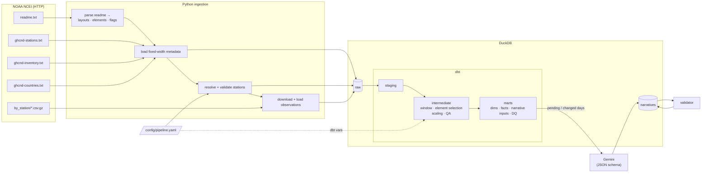

# Weather Data Platform

A local, config-driven data platform that ingests NOAA **GHCN-Daily** observations for
Canadian airport stations, models them with **dbt + DuckDB**, and generates
**AI-written daily weather narratives** with Google Gemini. The narratives are then
validated against the source data.

```
NOAA (HTTP) ─► raw (DuckDB) ─► dbt: staging ─► intermediate ─► marts ─► Gemini ─► validated narratives
                  ▲
  config/pipeline.yaml  — the only file that changes to add a city, move the window or swap the model
```

---

## Quickstart

Prerequisites: Python 3.11–3.13 and [uv](https://docs.astral.sh/uv/getting-started/installation/).
No Docker or cloud account is needed.

```bash
git clone <this-repo> && cd weather-data-platform
make install                 # uv sync --locked + dbt deps
cp .env.example .env         # add GEMINI_API_KEY (free, no billing: https://aistudio.google.com/apikey)
make run                     # ingest → dbt build (+tests) → narratives → validation → report
```

**No API key?** `make run-offline` runs the whole pipeline with a deterministic template
writer instead of Gemini. CI uses the same mode.

Step by step:

```bash
uv run weather ingest              # download + load (re-runs only transfer what NOAA changed)
uv run weather transform           # dbt build: models + data tests + unit tests
uv run weather narrate --limit 200 # Gemini narratives, most recent days first
uv run weather validate            # check narratives against source observations
uv run weather report              # data-quality + narrative summary
make docs                          # dbt docs + lineage graph at http://localhost:8081
```

<details>
<summary>Without uv (plain pip)</summary>

```bash
python -m venv .venv && source .venv/bin/activate
pip install -e .
(cd dbt && dbt deps --profiles-dir .)
weather run --provider fake
```
</details>

---

## How the requirements map to the implementation

| # | Requirement | Where / how |
|---|---|---|
| 1 | dbt + local DB | `dbt-duckdb`, one file at `data/warehouse/weather.duckdb` |
| 2 | Ingest observations **and** all reference files | [`ingestion/`](src/weather_platform/ingestion): readme, stations, inventory, countries + 5 `by_station` files |
| 3 | staging / intermediate / mart layers | [`dbt/models`](dbt/models): 7 staging, 4 intermediate, 8 mart models |
| 4 | Airport stations for the 5 largest metros | [`config/pipeline.yaml`](config/pipeline.yaml) → `stations` |
| 5 | Station and element selection driven by metadata, not hardcoded | Stations are validated or resolved against `ghcnd-stations.txt` + `ghcnd-inventory.txt`. Elements come from the inventory. Layouts, units and flags are parsed from `readme.txt`. See [Dynamic handling](#dynamic-station-and-element-handling). |
| 6 | Bulk LLM narratives | [`narratives/`](src/weather_platform/narratives): batched structured-output requests, rate-limited, resumable |
| 7 | Data quality throughout | [Data quality strategy](#data-quality-strategy): ingestion gates → 75 dbt data tests + unit tests → DQ marts → narrative validation |
| 8 | Reproducible GitHub repo + README | This file. `uv.lock` pins every dependency. CI runs the pipeline end to end offline. |
| ★ | Bonus: Airflow | [`orchestration/airflow`](orchestration/airflow): DAG + `docker compose` (standalone) |
| ★ | Bonus: validate narratives against source data | [`validator.py`](src/weather_platform/narratives/validator.py): numeric grounding, coverage and consistency |
| ★ | Bonus: incremental dbt models | `fct_daily_observations`: per-(station, element) watermarks + revision lookback |
| ★ | Bonus: new station with zero code changes | Add a `stations:` entry. Ingestion, the dbt incremental backfill and narratives pick it up. Covered by an end-to-end test. |

---

## Architecture



### Warehouse layout

| Schema | Owner | Contents |
|---|---|---|
| `raw` | Python | Files exactly as delivered (all `VARCHAR`) plus lineage (`_batch_id`, `_loaded_at`, `_source_file`). Also the parsed data dictionary (`ghcnd_elements`, `ghcnd_flag_definitions`, `ghcnd_file_layouts`), the control table `pipeline_target_stations`, and the `ingestion_log` audit table (sha256, ETag, row counts). |
| `staging` | dbt, views | Typed and renamed; sentinels (`-9999`, `-999.9`) nulled. Units and scale factors are *interpreted from the readme's unit text*. |
| `intermediate` | dbt, views | Target stations + coverage, the resolved analysis window, inventory-driven element selection, scaled and QA-annotated observations. |
| `marts` | dbt, tables | `dim_stations`, `dim_elements`, `fct_daily_observations` (incremental, enforced contract), `fct_daily_weather` (wide, date spine, generated columns), `mart_narrative_inputs`, `rpt_daily_weather_narratives` (view). |
| `data_quality` | dbt | `dq_station_element_completeness`, `dq_quality_flag_summary` |
| `dq_audit` | dbt | Stored failing rows for every test (`store_failures`) |
| `narratives` | Python | `daily_weather_narratives`, `narrative_validations`, `generation_runs` (requests, tokens, status) |

### Repository layout

```
config/pipeline.yaml            # the single source of configuration
src/weather_platform/
  config.py                     # typed, validated config (pydantic) + env settings
  warehouse.py                  # DuckDB connections + DDL for Python-owned tables
  ingestion/
    readme_parser.py            # data dictionary → layouts, element units, flag codes
    downloader.py               # retries, conditional GET, atomic writes, checksums
    loaders.py                  # validated, transactional, idempotent raw loads
    station_resolver.py         # config → station IDs, validated against metadata
    pipeline.py                 # ingestion stage orchestration
  transform/dbt_runner.py       # dbt with config-derived vars + auto full-refresh
  narratives/
    models.py · prompts.py      # data contracts · versioned prompt registry
    writers.py                  # Gemini + offline template writer (one Protocol)
    generator.py                # batching, rate limiting, budget, checkpointing
    validator.py                # deterministic grounding checks
    repository.py · service.py  # SQL · wiring
  reporting.py · cli.py
dbt/                            # models, macros, seeds, generic/singular/unit tests
orchestration/airflow/          # DAG + docker-compose
tests/                          # unit + offline end-to-end (mocked NOAA, real dbt)
```

---

## Dynamic station and element handling

The requirement: *"If we added a 6th city, only configuration should change, not SQL."*
In this pipeline nothing downstream of `config/pipeline.yaml` names a station, a city,
an element or a date.

### Stations are configured, then checked against the metadata

```yaml
stations:
  - city: Toronto
    station_id: CA006158731      # pinned: deterministic and auditable
  - city: Edmonton               # or resolved from the metadata by a rule
    match: { country_code: CA, state: AB, name_pattern: "EDMONTON INT*" }
```

* **Pinned IDs** are checked against `ghcnd-stations.txt` before anything is downloaded.
  A typo fails fast and points to `weather stations search`.
* **Match rules** are resolved against `ghcnd-stations.txt` + `ghcnd-inventory.txt` and
  ranked by the most recent TMAX/TMIN/PRCP coverage. For example, `EDMONTON INT*` has 3
  candidates, and the rule picks `EDMONTON INTERNATIONAL CS` (still reporting in 2026)
  over the retired `INT'L A`.
* The resolved list is written to the control table `raw.pipeline_target_stations`. That
  table is **the only way stations enter dbt**: they arrive as data, not as SQL or vars.
  A dbt `relationships` test checks it against the station metadata a second time.

I kept the five stations the brief names pinned, and added `match` for growth. Pinning is
reproducible. Matching is convenient but could change station when NOAA adds one, so the
choice is logged and stored alongside the rule that produced it.

### Elements come from the inventory and are described by the readme

* `int_station_elements_selected` keeps every (station, element) pair whose inventory
  `[firstyear, lastyear]` overlaps the analysis window. Config `include`/`exclude` globs
  (e.g. `exclude: ["WT*"]`) apply as policy on top.
* **Units and scale factors aren't hardcoded per element.** `readme_parser.py` extracts all
  89 element definitions, and `stg_ghcnd__elements` interprets the documented unit text
  (`tenths of degrees C` → ×0.1 °C, `hPa * 10` → ×0.1 hPa, …). Any element NOAA documents
  is scaled correctly with no code change. An element missing from the readme is flagged
  by a test.
* **The fixed-width layouts come from the readme too.** Column positions for stations,
  inventory and countries are read from its `Variable / Columns / Type` tables. A
  structural change fails loudly at parse time instead of silently mis-slicing data.
* `fct_daily_weather` pivots elements into columns **generated at compile time** from the
  selected elements. If a station starts reporting `AWND`, an `awnd` column appears.
* `mart_narrative_inputs` gives the LLM each station-day as a **self-describing list** of
  `{element, description, value, unit, previous_day_value}`. New elements reach the
  narratives with no Python change.

### The analysis window is resolved from the data

```yaml
analysis_window: { anchor: latest_common, lookback_days: 730 }
```

`latest_common` ends the window on the latest date that *every* target station has
reported, so all cities cover the same period. `latest_any` and `fixed` (+ `end_date`)
are also supported. With today's data this resolves to **2022-04-30 → 2024-04-28**
([why not the last 2 years](#data-findings)).

### What each config change costs

| Change | What happens | Full refresh? |
|---|---|---|
| Add a city | Only its file is downloaded. The incremental model sees no watermark for it and **backfills its whole window**. Only its days go to the LLM. | No |
| Remove a city | A post-hook trims its rows from the fact table | No |
| Include/exclude elements | New pairs backfill via watermark; excluded pairs are trimmed | No |
| Window anchor/length, QA-flag policy | Changes the meaning of already-built rows. The runner fingerprints these vars and **adds `--full-refresh` automatically**. | Automatic |
| Model or prompt version | Every day becomes eligible for regeneration (tracked per row) | n/a |

These paths are exercised in [`tests/integration/test_pipeline_e2e.py`](tests/integration/test_pipeline_e2e.py).

---

## Data quality strategy

Every layer has checks, and the severity policy is explicit. **Errors** mean the
*pipeline* is wrong (bad config, broken contract, scaling bug) and stop the build.
**Warnings** mean the *world* is imperfect (stale station, sparse month) and are
reported without blocking.

| Layer | Checks |
|---|---|
| Download | Retries with backoff on 5xx/429/transport errors. Atomic writes (never a truncated file). sha256 and ETag/Last-Modified recorded. Reloads are content-addressed. |
| Raw load | File-level gates run *before* replacing data, inside a transaction: the file is non-empty, every row belongs to the expected station, and the fixed-width key is populated (layout sanity). Unparseable rows are **counted** in `ingestion_log.rows_invalid`, not dropped. |
| Metadata and config | `readme.txt` structure asserted (required layouts, core elements, all three flag families). Config is validated twice: pydantic schema with unknown keys rejected, then station existence in the metadata. |
| Sources / staging | not_null/unique keys, lat/lon ranges, `first_year <= last_year`, one row per (station, date, element). QFLAG/MFLAG codes must exist in the readme's flag definitions. Ingestion freshness. |
| Intermediate | A single-row window with `start <= end`. Every target station has in-scope elements, which catches a station that stopped reporting before the window. Undocumented elements are flagged. |
| Marts | **Enforced dbt contracts** on `dim_stations` and `fct_daily_observations`. Relationships. Physical plausibility from a bounds-per-element seed, which catches scaling regressions (a TMAX of 289 means ×0.1 was skipped). TMIN ≤ TMAX. The date spine is complete. |
| DQ marts | Monthly completeness per station and element against expected days, for configured categories (`temperature`, `precipitation`; event-based series like snow depth are sparse by nature). QA-flagged observations explained with the readme's flag text. Station staleness. |
| dbt unit tests | Unit and scale derivation from readme text. Scaling, QA rejection and trace handling. Source-specific unit corrections. |
| Narratives | Schema-validated JSON. Ids matched back to inputs; missing or unknown ids are rejected and retried next run. Length bounds. Then the [validator](#validating-narratives-against-the-source-data). |

NOAA-flagged values are **kept** in `fct_daily_observations.value` but excluded from
`value_clean`, so analysts can see what was rejected and why. Which QFLAGs reject a value
is itself config (`quality.rejected_qflags`).

Sample `weather report` output:

```
Analysis window: 2022-04-30 -> 2024-04-28 (anchor: latest_common)

city       station_id   name              last obs    days stale   window coverage %
Calgary    CA003031092  CALGARY INTL A    2024-04-28  885 (STALE)  100.0
Montreal   CA007025251  MONTREAL INTL A   2024-04-28  885 (STALE)  99.9
Ottawa     CA006106001  OTTAWA INT'L      2024-04-28  885 (STALE)  100.0
Toronto    CA006158731  TORONTO INTL A    2024-04-28  885 (STALE)  100.0
Vancouver  CA001108395  VANCOUVER INTL A  2025-08-24  402 (STALE)  99.9

NOAA QA-flagged observations (excluded from value_clean)
station_id   element  qflag  meaning                            count
CA003031092  SNWD     I      failed internal consistency check  4
CA003031092  SNOW     I      failed internal consistency check  2
CA006106001  WSFG     X      failed bounds check                1
CA006158731  WSFG     X      failed bounds check                1
```

---

## Data findings

Profiling the real files surfaced issues a naïve pipeline would have published silently.

1. **Four of the five specified station IDs stop on 2024-04-28 in GHCN-Daily** (YVR
   continues to 2025-08-24). "The last two years" therefore can't be hardcoded: the window
   is resolved from the data (`latest_common`), and `dim_stations.is_stale` raises a
   warning for each station. Newer IDs exist for some airports (e.g. Calgary
   `CA003031094 CALGARY INT'L CS`, reporting through 2026) and are one config line away;
   `weather stations search "CALGARY*" --country CA` lists them. I kept the stations the
   brief specifies.

2. **Environment Canada wind values don't use the units the readme documents.** For
   source flag `C`:
   * `WSFG` (peak gust) is in **tenths of km/h**, not tenths of m/s. Every value is a
     multiple of 10, the minimum is 310 (EC's 31 km/h gust-reporting threshold), and at
     the documented unit the *median* daily gust would be 155 km/h.
   * `WDFG` (gust direction) is in **tens of degrees** (observed range 1–36), not degrees.

   Both are handled by [`seeds/source_unit_corrections.csv`](dbt/seeds/source_unit_corrections.csv):
   evidence-documented overrides keyed by (element, source flag) that convert to the
   element's documented unit, so each element keeps one unit in the marts. The gust
   plausibility bound (≤ 70 m/s) makes the build fail if the correction is ever lost.

3. **NOAA's own QA rejects real events because of that unit mismatch.** On 2022-05-21
   (the Ontario derecho) Ottawa and Toronto reported gusts of 120/121 km/h. Read as m/s,
   these fail NOAA's bounds check and carry QFLAG `X`. The pipeline respects NOAA flags
   by default and reports them in `dq_quality_flag_summary`, but this argues for
   per-source QA exceptions (see improvements).

4. `SNWD` is reported only when snow is on the ground and `WT**` only when an event
   occurs, so completeness is monitored per configured category rather than blindly.

---

## Narrative generation

### Bulk strategy

Free-tier quotas are small, and a 2-year × 5-station window is **3,648 station-days**.
One request per day would burn days of quota. So:

* **Batching with structured output.** Each request carries `batch_size` (40) station-days
  and a strict JSON `response_schema` (`{narratives: [{id, narrative}]}`). The backfill
  takes **~92 requests**, and a daily incremental run takes one.
* **Pacing and retries.** Requests are spaced to `requests_per_minute`. 429/5xx responses
  are retried with exponential backoff and jitter. Non-retryable errors (bad key,
  unknown model) abort immediately with an actionable message.
* **Budget.** At most `max_requests_per_run` requests; the rest stays pending. Days go
  **most recent first**, so a partial run still delivers the most useful output.
* **Idempotent and resumable.** Work is derived from the warehouse: a day is pending if it
  has no narrative, or if its `input_hash` (computed in dbt from the exact prompt inputs),
  model, provider or prompt version changed. Each batch is committed as it returns, so a
  crash loses at most one batch. Re-running is a no-op. When the wind-unit correction
  changed inputs, only the 2,646 affected days were regenerated.
* **Observability.** `narratives.generation_runs` records pending, requests, written,
  failed, token usage and status (`succeeded | partial | failed`) per run.
* **Prompts are versioned code** ([`prompts.py`](src/weather_platform/narratives/prompts.py)).
  Config selects a version, and every stored narrative records the version and model that
  wrote it.

### Validating narratives against the source data

An LLM judge is itself unverified, so the primary check is deterministic
([`validator.py`](src/weather_platform/narratives/validator.py)):

1. **Grounding (fail).** Every number the narrative states with a unit (°C, mm, cm, m/s,
   km/h) must match an input value after unit conversion and rounding tolerance. Input
   values are today's value, the previous day's, the day-over-day change and the diurnal
   range. A hallucinated or mis-converted number fails.
2. **Coverage (warn).** The high and low temperatures should be mentioned when present.
3. **Consistency (warn).** Rain or snow described on a day with 0 mm and no weather-type
   flag, with simple negation handling ("no rain" is fine).

Results are stored per narrative together with the `input_hash` they checked, and are
surfaced in `marts.rpt_daily_weather_narratives` and `weather report`.

---

## Orchestration

* **CLI** (`weather …`) and **Makefile** for local use. `weather run` runs everything.
* **Airflow** ([`orchestration/airflow`](orchestration/airflow)): `ingest → dbt_build →
  generate_narratives → validate_narratives`.
  * dbt and Airflow pin conflicting dependency ranges, so the project runs in **its own
    virtualenv** and tasks call its CLI. The code is identical to local runs and CI, and
    Airflow upgrades can't break the pipeline.
  * DuckDB is single-writer, so the DAG uses `max_active_runs=1` and a 1-slot pool.
    Per-station downloads are parallelised inside the ingest task rather than as mapped
    tasks fighting over the file lock.

  ```bash
  make airflow-up    # docker compose, standalone mode, UI on http://localhost:8080
  ```

---

## Testing and CI

```bash
make check          # ruff + mypy --strict + pytest
```

* **pytest (50 tests).** Unit tests cover the readme parser (against the real readme),
  config validation, the downloader (retries, 304s, no partial files), loaders
  (idempotency, rejection), station resolution, the generator (batching, budgets, partial
  and failed batches, rate limiting), prompt rendering and the validator.
* **Offline end-to-end tests.** A mocked NOAA server (`httpx.MockTransport`, honouring
  ETags) drives real ingestion, a **real `dbt build`**, narratives and validation. They
  also cover adding a station by config (incremental backfill, no full refresh) and the
  automatic full refresh when the window changes.
* **dbt.** 75 data tests + 3 unit tests run on every `weather transform`.
* **GitHub Actions** runs lint, types and all tests on every PR, plus a live smoke test
  against real NOAA data (offline writer) on `main`.

---

## Tradeoffs

| Decision | Why | Cost |
|---|---|---|
| Raw layer stores strings only | Loads never fail on bad values. Typing and rules live in tested, documented dbt. Bad rows are counted, not lost. | Casting happens in staging |
| Parse layouts and units from `readme.txt` | Metadata-driven all the way down; structural changes fail loudly | A wording change could need a parser tweak (tests pin the current format) |
| Stations as a control table, not dbt vars | Tested in dbt, visible in lineage, no SQL change per city | One more table |
| Pinned IDs + optional match rules | Reproducible by default, flexible when wanted | Match rules can drift; mitigated by logging and storing the resolved choice |
| Keep QA-rejected values (`value` vs `value_clean`) | Transparency; the rejection policy is config | Consumers must use `value_clean` |
| Long fact + generated wide table | Long is generic and incremental-friendly; wide is analyst-friendly | Generated columns can't carry an enforced contract |
| 40 days per LLM request | Fits free-tier quotas | A bad response affects a batch; mitigated by per-id acceptance and retry next run |
| Deterministic validator over an LLM judge | Reproducible, free, explainable | Can't judge tone or qualitative claims |
| DuckDB single file | Zero-ops and fast locally | Single writer; serialised in Airflow |
| dbt in-process (`dbtRunner`) | One process, shared config, typed results | dbt-duckdb holds its connection open, so the Python side avoids read-only connections |

## What I would improve with more time

1. **Per-source QA exceptions.** Scope `rejected_qflags` by source/element, so NOAA `X`
   flags caused by the EC unit mismatch (finding 3) can be reinstated.
2. **Automated unit-anomaly detection.** Turn the profiling that found the EC unit issues
   into a test that compares each (element, source) distribution with expected physical
   ranges, instead of relying on curated corrections.
3. **Successor-station stitching.** Model station lineage (old → new climate ID) so a city
   has a continuous series across ID changes.
4. **Gemini Batch API.** On a paid tier, use the asynchronous Batch API (cheaper, higher
   limits) with request-level idempotency keys.
5. **LLM-as-judge as a second validation tier** for qualitative claims, sampled, budgeted
   and calibrated against the deterministic checks.
6. **Climatology context** ("warmer than normal for late April") from station normals,
   with the validator extended to check those comparisons.
7. **Astronomer Cosmos** for one Airflow task per dbt model, plus alerting on warnings
   (staleness, completeness).
8. **Scale-out storage.** Land Parquet in object storage partitioned by station/year and
   move to MotherDuck or a cloud warehouse. The dbt project is largely portable; the
   DuckDB-specific parts are `glob`, `list`/`struct_pack` and `generate_series`.
9. **More CI coverage:** a DagBag import test for the DAG and SQL linting (sqlfluff).

---

## Configuration reference

All settings live in [`config/pipeline.yaml`](config/pipeline.yaml) (commented) and are
validated by [`config.py`](src/weather_platform/config.py). Unknown keys are rejected.
Environment variables (see [`.env.example`](.env.example)) hold secrets and a few
overrides: `GEMINI_API_KEY`, `WEATHER_LLM_PROVIDER`, `WEATHER_LLM_MODEL`,
`WEATHER_CONFIG_PATH`, `WEATHER_DUCKDB_PATH`.

## Troubleshooting

* **`GEMINI_API_KEY is not set`**: add it to `.env`, or run with `--provider fake`.
* **HTTP 429 from Gemini**: expected on the free tier. The run backs off and retries; if
  the daily quota is exhausted it ends as `partial`, and the next run resumes.
* **Different model**: set `WEATHER_LLM_MODEL` (AI Studio lists the models your key can use).
* **Start over**: `make clean && make run`.
